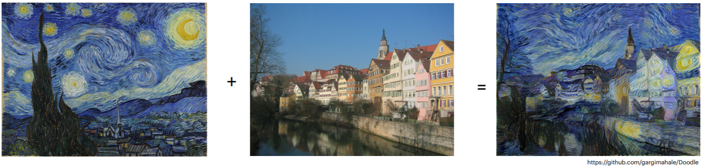
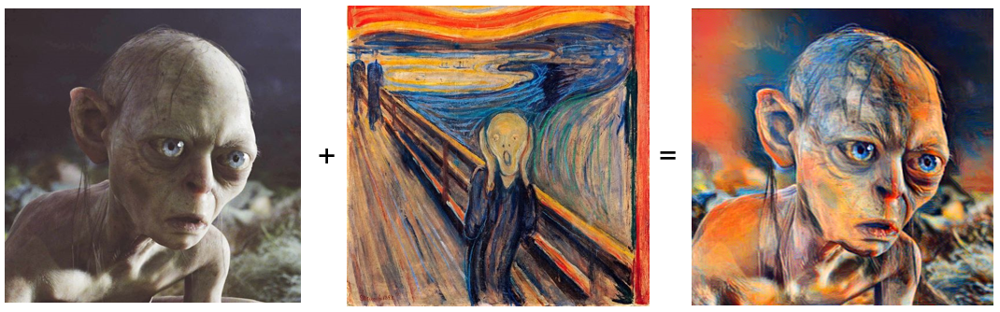

# Neural Art Transfer Using Neural Networks
A easy tutorial to generate images like a real artist. This repository is a tutorial to neural art transfer using neural networks. In general, the texture of a given style image is extracted and applied onto a content image.




Theory based on following papers:
- [A Neural Algorithm of Artistic Style](https://arxiv.org/abs/1508.06576)
- [Semantic Style Transfer and Turning Two-Bit Doodles into Fine Artworks](https://arxiv.org/abs/1603.01768)

Not only real artistic styles can be transfered, but also characteristics of faces. The possibilities are endless.

## Overview
- [neural_transfer](/src/neural_transfer.ipynb)
Simple cnn for combining style and content image.
- [neural_transfer_using_image_segmentation](https://github.com/gargimahale/Doodle/blob/master/stylize.py)
Advanced approach, where segmentation maps are used in order to define classes. A fast tensorflow implementation based on [gargimahale/Doodle](https://github.com/gargimahale/Doodle/blob/master/stylize.py) which implements Neural Doodles.
- [/src/input](/input) Some example style and content images are provided in the directory input.
- [/src/output](/output) This directory saves all generated images.

## Usage
This repository is deployed with docker. In oder to use a jupyter notebook, we require a python kernel. Therefore simply build and startup the container for a integrated IDE in your browser. If you don't have Docker avilable, you can create your own virtual environment and use it directly in your IDE and the jupyter notebook.

Simply execute the following lines:
```
docker build -t artsy_jupyter .
```
It takes probably some minutes to build up the docker container. Now we need to start our builded docker container using docker compose:
```
docker compose up -d
```
Now a JuypterLab installation is running locally. You can enter the script by opening the following link: [localhost:7777](localhost:7777). 

**Important: The password is `artsy`**
We want to check the file `neural_transfer.ipynb`.
To shut down the container:

```
docker compose down
```

### Without Docker
If you don't have Docker and Docker Desktop available, please create a python virtual environment, see [Python env](https://docs.python.org/3/library/venv.html). Or you can use [Poetry](https://python-poetry.org/). 

##### Pip
If you have pip installed on Windows, you can install the dependencies as followed.
```
python -m venv .venv
./.venv/Scripts/activate
pip install -r requirements.txt
``` 
Now, you have to connect your IDE to the virtual environment.
### Advances Topics

Check out the segmentation page: [alexjc/neural-doodle](https://github.com/alexjc/neural-doodle)

There is also a docker container available: 
```
# Setup the alias. Put this in your .bash_rc or .zshrc file so it's available at startup.
alias doodle="docker run -v $(pwd)/samples:/nd/samples -v $(pwd)/frames:/nd/frames \
                         -it alexjc/neural-doodle"

# Now run any of the examples above using this alias, without the `.py` extension.
doodle --help
```


# References
Inspired by the following githup repos:
- [alexjc/neural-doodle](https://github.com/alexjc/neural-doodle)
- [gargimahale/Doodle](https://github.com/gargimahale/Doodle/blob/master/stylize.py) 
- [winston6/tutorials](https://github.com/winston6)